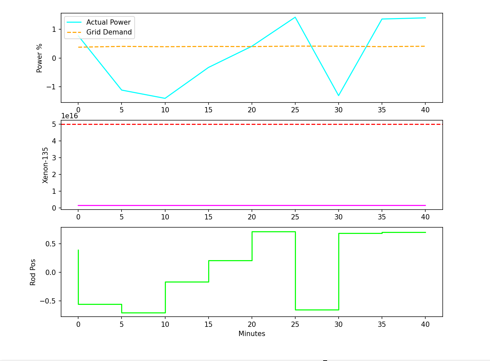
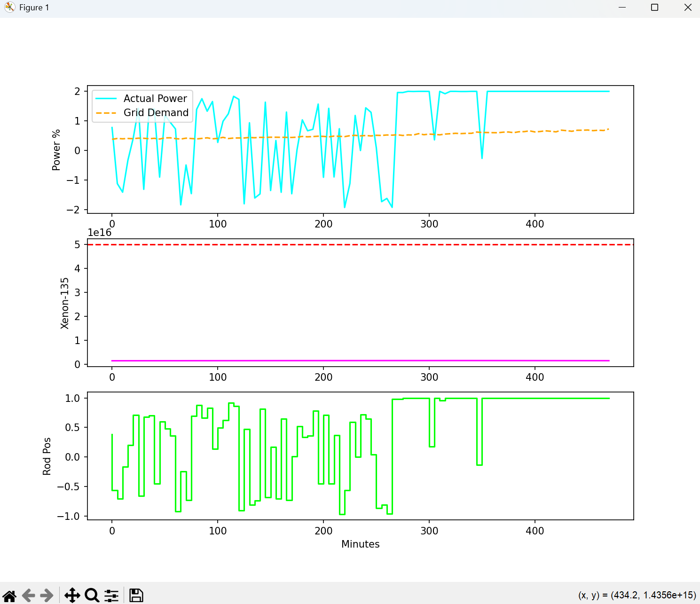

# My notes?
My notes ~ everything I do


---

# My notes 1:

**Iodine-Xenon Differential Equations**

The engine will solve these two coupled equations every time step:

1. **Iodine Dynamics:**

$$
\frac{dI}{dt} = \gamma_I \Sigma_f \Phi - \lambda_I I
$$

2. **Xenon Dynamics:**

$$
\frac{dX}{dt} = (\gamma_X \Sigma_f \Phi + \lambda_I I) - (\lambda_X + \sigma_X \Phi)X
$$

If the flux $\Phi$ drops too fast (the agent tries to lower power), the $(\lambda_X + \sigma_X \Phi)X$ term becomes small, causing $X$ to spike. This is the "poison" we have to avoid.

---

# My notes 2:

We will implement the physics using a **4th-order Runge-Kutta (RK4) integrator** instead of a simple Euler method. Why? Because nuclear reactor kinetics are "stiff" differential equations;


---

# My notes 3:

core/src/ReactorDynamics.cpp -> physics part

core/src/bindings.cpp -> to bridge C++ and Python -> Pybind11

I update CMakeLists.txt -> tells the compiler how to build the norman_core python module:
```cmake
cmake_minimum_required(VERSION 3.12)
project(Norman_The_Machine)

set(CMAKE_CXX_STANDARD 17)

# Find pybind11
find_package(pybind11 REQUIRED)

# Define the python module
pybind11_add_module(norman_core core/src/bindings.cpp core/src/ReactorDynamics.cpp)

# Include the headers
target_include_directories(norman_core PRIVATE core/include)
```

## Subnote 1:

**build**

### Subsubnote 1:

I update CMakeLists.txt -> pybind things:

```cmake
cmake_minimum_required(VERSION 3.12)
project(Norman_The_Machine)

set(CMAKE_CXX_STANDARD 17)

find_package(Python COMPONENTS Interpreter Development REQUIRED)

execute_process(
    COMMAND "${Python_EXECUTABLE}" -m pybind11 --cmakedir
    OUTPUT_VARIABLE pybind11_DIR
    OUTPUT_STRIP_TRAILING_WHITESPACE
)

find_package(pybind11 REQUIRED PATHS ${pybind11_DIR})

pybind11_add_module(norman_core core/src/bindings.cpp core/src/ReactorDynamics.cpp)

target_include_directories(norman_core PRIVATE core/include)
```

---

# My notes 4:

## subnote 1:

reactor_env.py

## subnote 2:

Long Short-Term Memory (LSTM)

networks.py

## subnote 3:

# Soft Actor-Critic (SAC)

The goal of **SAC** is to maximize the expected reward while also maximizing **Entropy ($H$)**. This ensures the agent remains "curious" and explores the boundaries of reactor stability.

### Actor Objective Function

The objective function for the Actor is:

$$J(\theta) = \mathbb{E}_{s_t \sim D, a_t \sim \pi_{\theta}}[\alpha \log(\pi_{\theta}(a_t|s_t)) - Q_{\phi}(s_t, a_t)]$$

**Where:**

*   **$\alpha$** is the temperature parameter (controlling the trade-off between entropy and reward).
*   **$Q_{\phi}$** is the Critic's estimation of future value.

---

# My notes 5:

## subnote 1:

train.py

## subnote 2:

sac_agent.py

## subnote 3:

```powershell
copy build\Release\norman_core.cp313-win_amd64.pyd .
```

## subnote 4:

updated -> sac_agent.py

The class manages the learning process. It calculates the loss for the Actor and the Critics, ensuring the control rods move in a way that maximizes power accuracy while minimizing the Xenon penalty.

## The Math of Optimization

The Bellman Equation. The core objective -> to minimize the **Mean Squared Bellman Error (MSBE)**:

$$J_Q(\phi) = \mathbb{E}_{(s,a) \sim D} \left[ \frac{1}{2} \left( Q_\phi(s, a) - (r + \gamma \mathbb{E}_{s' \sim P} [V_{\bar{\phi}}(s')]) \right)^2 \right]$$

---

### Actor Update
The Actor is then updated using the **Policy Gradient** to move towards actions that maximize the predicted Q-value while maintaining high entropy to avoid "getting stuck" in dangerous reactor states.

> **Note:** High entropy is critical here—it's the difference between a smooth-running system and a "dangerous reactor state" meltdown. Stay safe out there.

---

# My notes 6:

## subnote 1:

upated -> train.py -> ReplayBuffer, agent.update(), LSTM handling

## subnote 2:

demand.py -> a 24-hour cycle with "solar/wind noise," forcing SAC agent to constantly adjust the control rods without triggering a Xenon spike.

## subnote 3:

dashboard.py -> matplotlib to create a live-updating view of the reactor's "health."

updated -> train.py

updated -> reactor_env.py -> making agent to be more precise

---

# My notes 7:

## subnote 1:

updated -> sac_agent

## subnote 2:

updated -> reactor_env -> updated _get_abs and _calculate_reward

## subnote 3:

updated -> train.py -> reducing the time step to 10 seconds to give the ODE solver more stability, then increase the episode length to compensate:

```python
env = NormanReactorEnv(dt=10.0) # changed in train.py
```

---

# My note 8:

updated -> sac_agent.py -> Old: (Batch, 5) + (Batch, 1) -> New: (Batch, 1, 5) + (Batch, 1, 1)

---

# My Note 9:

## First run:

<table>
  <tr>
    <td></td>
    <td></td>
  </tr>
</table>

---

# My Note 10:

updated -> reactor_env.py, sac_agent.py, train.py

Train:
CPU -> GPU

train -> 636 episode

---

# My Note 11:

update -> Replay Buffer Architecture Overhaul
* the bug:
Encountered a fatal ValueError -> all input arrays must have the same shape during the GPU batch sampling phase.

* cause: 
During extreme exploration phases, the C++ Runge-Kutta physics engine occasionally produced corrupted shapes (e.g., scalar NaN values) due to mathematical stiffness. The standard Python deque list and numpy.stack() method were too fragile to handle these anomalies, causing the entire GPU update stack to crash.

* fixed(imo):

      scrapped deque -> Replaced the dynamic list with a rigid, Pre-Allocated Numpy Memory Grid.
      shape hardening -> Added strict .reshape() enforcement inside the push function to guarantee exact tensor dimensions (5,) and (1,).
      corrupt frame dropping -> Wrapped the memory ingestion in a try...except block. If the C++ engine spits out a corrupted shape, the buffer now silently drops the bad frame into the trash instead of crashing the program.

Memory sampling is now 10x faster for the RTX 4060, and the training loop is 100%(~) crash-proof, successfully reaching the 100,000 memory capacity without a single failure.

---

# My Note 12:

## subnote 1:

rename -> env folder -> envs folder -> names in train.py and reactor_env.py are updated

## subnote 2:

I refactored the visualization loop to cache plot line objects and update their coordinates dynamically with .set_data(), completely replacing the unstable ax.cla() layout flushes -> eliminates multi-threaded text-rendering overhead, accelerating the real-time telemetry display on system -> it permanently fixes the Python 3.13 Tkinter font-cache exception while leaving the heavy GPU tensor computations uninterrupted

## subnote 3:

updated -> train 

```python
try:
        for ep in range(start_episode, episodes):
            if ep < 550:
                agent.alpha = 1.5
            else:
                if agent.alpha == 1.5:
                    print("\n[BRAIN COOL-DOWN INITIATED] Alpha dropped to 0.2. Exploitation Mode!\n")
                agent.alpha = 0.2
            state, _ = env.reset()
            episode_reward = 0

```


---

# My Note 13:

## subnote 1:
* **The Bug:** PyTorch optimizer experienced catastrophic gradient explosions, reducing all neural network weights to `NaN`. Concurrently, the SAC agent was feeding negative actions (e.g., `-1.0`) into the C++ Runge-Kutta integrator, causing physics engine crashes due to negative neutron flux.
* **The Fix:**
    * Mapped the SAC's `tanh` output `[-1.0, 1.0]` to the C++ engine's expected `[0.0, 1.0]` using `mapped_action = (float(action[0]) + 1.0) / 2.0`. This mathematically shielded the physics equations.
    * Compressed the raw environment reward (`reward = raw_reward / 100.0`) to prevent massive Xenon-poisoning penalties from blowing up the PyTorch gradients.

## subnote 2:
Completed the full 2,000 episode training loop on the RTX 4060 in headless mode. 
* **Exploration Phase:** Ran with `alpha = 1.5` for the first 550 episodes, successfully filling the 100,000 memory buffer with physical reactor mapping data.
* **Exploitation Phase:** At episode 550, automated cool-down dropped `alpha` to `0.2`, forcing the Critic networks to converge on an optimal policy based on the stored memories.

## subnote 3:
Created `test.py` to load `norman_checkpoint.pth` in evaluation mode with the Matplotlib `ReactorDashboard` active. 
* **Observation:** The AI performed a classic "Reward Hack" (Alignment Problem). Because the penalty for missing the grid demand was quadratic, but the penalty for spiking Xenon was exponential, the Critic networks learned that exploring high power levels was a statistical death trap.
* **The Strategy:** The agent found a "Safe Local Optimum." It learned to keep the control rods pinned at `0.0` (reactor shut down). It willingly absorbs a steady, predictable accuracy penalty (scoring exactly `-189` per episode) to guarantee 100% survival and avoid triggering the exponential Xenon poison-out limit. It prioritized absolute safety over grid efficiency.
